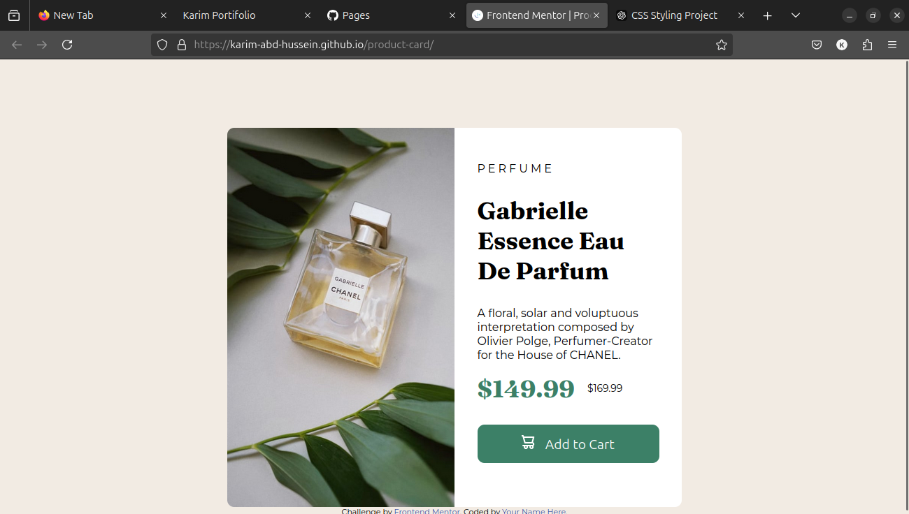
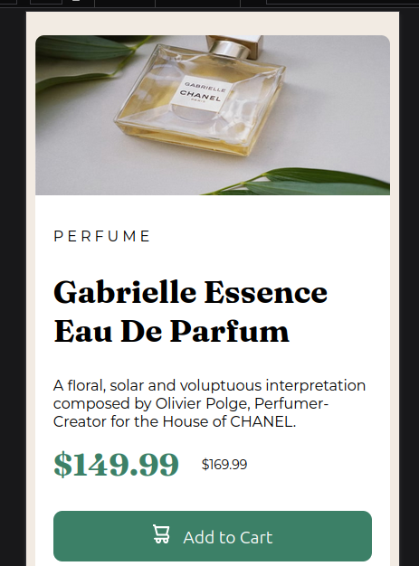

# Product Preview Card Component

## Table of Contents

- [Overview](#overview)
- [Features](#features)
- [Screenshots](#screenshots)
- [Technologies Used](#technologies-used)
- [Attribution](#attribution)

---

## Overview

This project is a responsive product preview card component built as part of a challenge on [Frontend Mentor](https://www.frontendmentor.io). The card features a perfume product with details including name, description, pricing, and an "Add to Cart" button.

---

## Features

- Responsive design optimized for both desktop and mobile views.
- Clean and modern UI design.
- Interactive button hover effect.

---

## Screenshots

### Desktop View

### Mobile View

---

## Technologies Used

- **HTML5**: Semantic structure of the web page.
- **CSS3**: Styling with custom variables and media queries for responsiveness.
- **Google Fonts**: Fonts "Montserrat" and "Fraunces" for typography.

---

## Attribution

- **Developer**: [Karim Hussein]
- **Demo live**:[live](https://karim-abd-hussein.github.io/product-card/)
